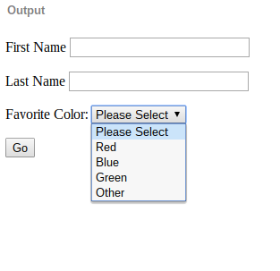

# Forms

Create a form in JSBin that submits your first name, last name, and favorite 
color to https://loyolalawtech.org/class-exercises/test.php via a POST request.  
The name fields should be two text inputs and your favorite color should be 
chosen from a <select> element with at least four options.  Each input should 
have a label in order for your user to know what it is for. Your form should 
submit to that URL via a POST request.

Here's an idea of what your form should look like:

