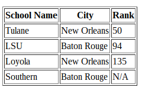

# Tables

Tables are very important for representing tabular data and are commonly used 
in legal applications.  So, in class I would like you to create a table in 
JSBin that is properly laid out and contains a header and a body. For our data, 
we will use information about Louisiana law schools. Your completed table 
should look like this:

