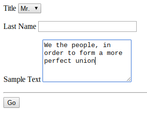

# Homework 2 - Submitting Forms

## Due February 1, 10am

For this homework, I am going to ask you to build form and submit it to a 
remote server for processing.  So create a form with the following attributes:

* A select with the label "Title", the name "title", and three options "Mr.", 
"Ms." and "Dr."
* A text input with the label "Last Name" and the name "last_name"
* A textarea element with 5 rows, the label "Sample Text", and the name 
"sample_text". Inside the textarea, this text should be displayed:

```
We the people, in order to form a more perfect union
```

Your form should look something like this:



Your form should submit a POST request to 
https://loyolalawtech.org/class-exercises/homework2.php 

You should submit your form to the server using __your own title and last 
name__  along with the sample text above.  If you have submitted the form 
correctly,
the server should respond to you with a greeting and a  [cryptographic 
hash](https://en.wikipedia.org/wiki/Cryptographic_hash_function) of your data. 
The hash is a long string of numbers and letters. Please email me the hash 
(this is how I will tell you have submitted the data properly) along with a 
JSBin of your HTML.

Notes: This should be modified so that students get the return values from the 
server script. Will assist them in seeing if they have submitted correct 
values.


