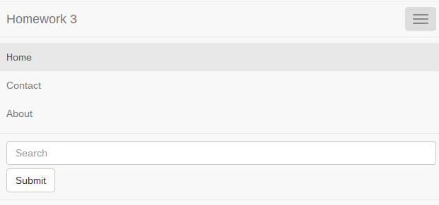
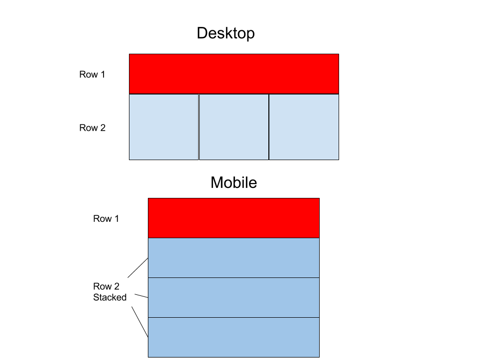

# Advanced Layout with Bootstrap

For homework, I would like you to try to lay out a more advanced page in 
Bootstrap.  Make up a website home page in JSBin, using Bootstrap. You can do 
whatever you want for the content: a law firm page, a page about your hobby, 
some Lorem Ipsum, whatever. The key thing is that it have the following 
elements:

1. A navbar for site navigation using the nav element. Your navbar should have 
   three navigation links (e.g, "Home", "About", "Contact") and one input for 
   searching the site. It does not matter for now if the links and search input 
   don't actually do anything, we're just interested in the layout. You can 
   look at the Bootstrap documentation 
   [here](http://getbootstrap.com/components/#navbar) for hints, but you do not 
   want to cut and paste their example in its entirety. What I am asking for is 
   a bit simpler, so you will have to study their markup and modify it for this 
   navbar. Note that the output on your JSBin is mobile-sized by default, so 
   your navbar should show a "hamburger" menu like so:

   

   When you pop out the output into its own browser window, you get a regular 
   desktop navbar that looks something like this:

   

2. The page below the navigation should then have a layout grid that is two 
   rows.  The first row should take up all 12 columns on desktop and mobile 
   (hint: you will want your column div to have the class "col-lg-12").  The 
   second row should have three columns which are horizontal on desktop but 
   which stack vertically on mobile. Your content, whatever it might be, should 
   go inside the rows/columns. Here is a crude sketch to illustrate the layout 
   of our grid:

   

This is a very challenging assignment. You will want to leave yourself extra 
time to do it. Feel free to consult the numerous Bootstrap tutorials on the 
web, look through the questions on [Stack Overflow](http://stackoverflow.com), 
or to contact me and your classmates with questions.

