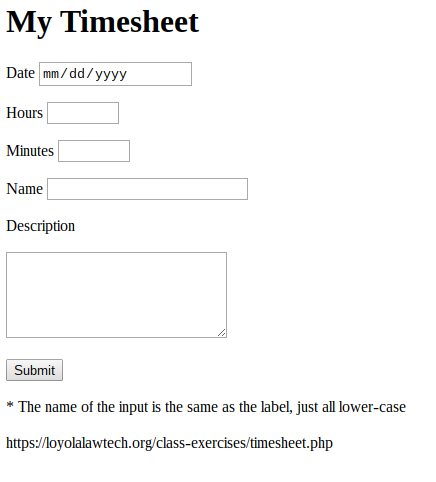

# Submitting Form Data to a Server

We are going to create a simple timekeeping app. It takes information about 
work that the user has done and writes it to a file on our server (a simple 
database). Create a form with these fields: Date, Hours, Minutes, Name, and 
Description. The Date field will provide a datepicker using the input 
type=date; the hours and minutes will be the input type=number. The description 
will be a textarea.

Have the form submit to 
https://loyolalawtech.org/class-exercises/timesheet.php. Once successful, you 
should be able to submit your data, click the link in the response from the 
server, and see your time entries.

The form should look like this:

