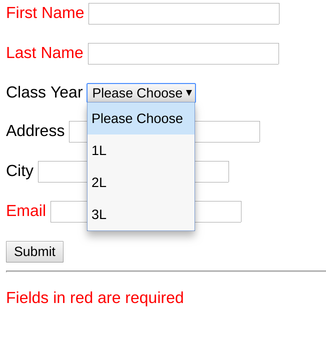

# Homework 2 - Forms 

## Due Monday, February 12 by 5pm

For this homework, you will create a form that looks like this:

Your form must have the following features:

* Submits a POST request to https://loyolalawtech.org/homework/form.php with no 
errors. The server should respond with the data you submit. The server expects 
your inputs to have the following names: fname, lname, address, year, city, 
email.
* Uses CSS to create a class called "required" which makes the label text red 
for the required fields
* Uses CSS to make the form's font Arial.

