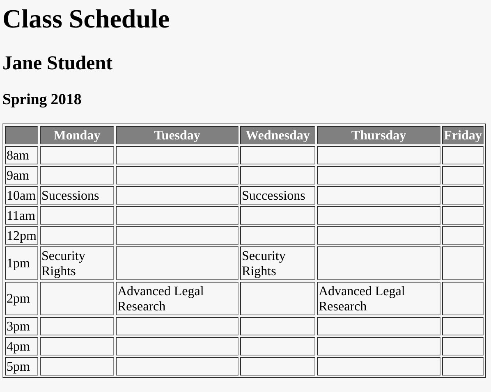

# Homework #1 - Tables

## Due Wednesday, January 31 at 10am.

For this assignment, I would like you to create a table which contains your 
class schedule for this semester. The table will look something like this, but 
will contain your actual class schedule along with the correct times:

For full credit, your markup must be correct, with no missing tags. Your table 
needs to have a thead and tbody section. Extra credit will be given if you 
figure out how to put a grey background with white text in your header, as 
shown in the example.

Remember, to submit your assignment, click "Share" on your JSBin and email me 
the URL there provided.
