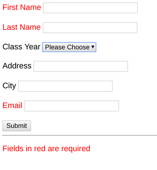

# Homework 4 - Forms 

## Due Wednesday, February 5 by 5pm

For this homework, you will create a form that looks like this:




Your form should submit a POST request to 
https://loyolalawtech.org/homework/form.php with no errors.  The server should 
respond with the data you submit. The server expects your inputs to have the 
following "name" properties: fname, lname, address, year, city, email.

HINT: 

Your first name input might look something like this:

```html

<input type="text" name="fname" id="fname">

```

Your form should be in a file called form_homework.html in your public_html 
folder.

### Extra Credit

* Properly include skeleton.css in your page (1 pt)
* Use your own CSS to create a class called "required" which makes the label 
text red for the required fields (2 pts).

