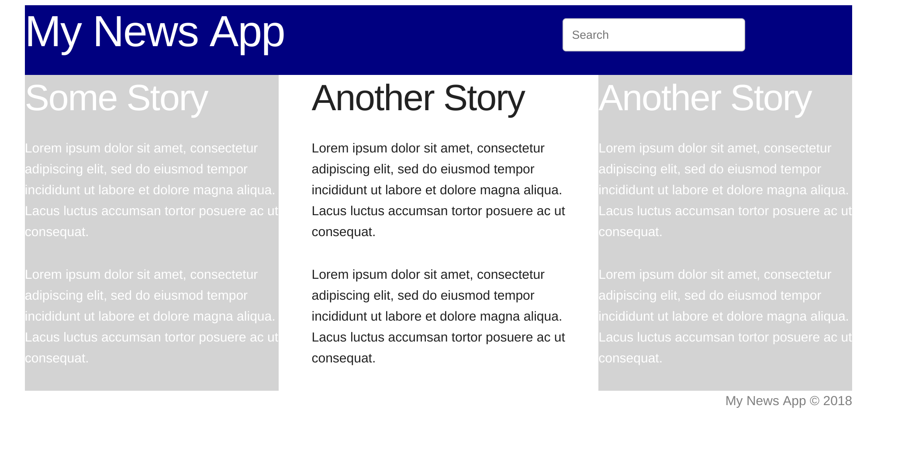
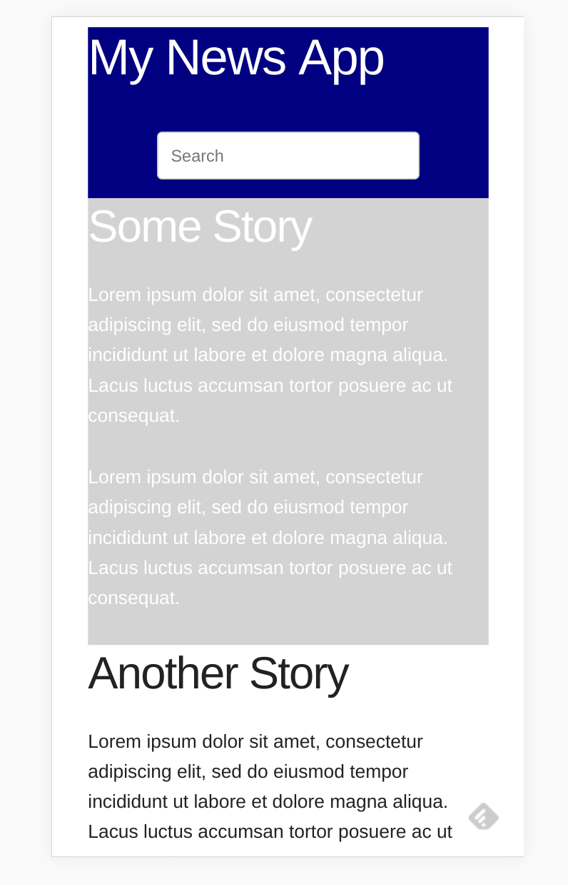

# Homework 5 - The Grid

## Due Wednesday, February 12 at 5pm

When you lay out a rough sketch of what an app will look like, the process is 
called *wireframing*. For this assignment, I would like you to wireframe a 
small news app using the [Skeleton CSS](http://getskeleton.com/#grid) grid that 
we learned in class.

Your one-page app should have three rows total. The first row has two columns, 
one with the app's name in large letters, the other with a search box. The next 
row should contain three columns, each with a title and some sample news text.
The last row contains a copyright notice. On a desktop browser, the columns 
should spread out, but on a mobile device, they should stack one on top of the 
other. 

Here is an example of what the desktop would look like:

And here is an example of mobile:

Some notes:

* Put your code inside a file called grid_homework.html in your public_html 
directory
* You may use the Lorem Ipsum generator in vim (":Loremipsum") or your own 
text.
* You will note that the search box has the word "Search" inside of it instead 
of a label like we have been using. Have a look at the [Skeleton example form 
code](http://getskeleton.com/#forms) to see how this is done. By the way, your 
search box does not have to do anything, we just want to see how it looks.
* You can use whatever background colors you want to distinguish your three 
columns of news, but make sure you create some CSS classes to make a background 
color or two.

* Extra credit: You may find that your search box doesn't position inside its 
column very nicely.  Google the CSS margin-top and margin-left property if you 
want to try to move it around.

This is by far our hardest assignment so far. Good luck!
