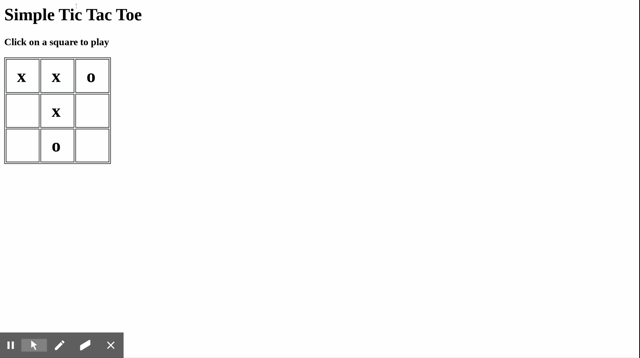

# Homework 7 - jQuery

# Due before the last day of class

This is going to be a hard homework about which you will have to think. [In the 
lecture I published 
today](https://loyno.zoom.us/rec/share/1c98Ke_a51pJWc-dt0vwa696EtW6T6a8gHcf8_EOmEyZgJmlt-kB8CUoLhlV9bKY?startTime=1585149133000), 
we learned how to include jQuery in our pages and how to use a few jQuery 
methods.

Please create a file in your public_html directory called remote-classHM1.html 
and another called remote-classHM.js. In that file I would like you to attempt 
to create an interactive game of TicTacToe which works like this:



When the user clicks on a square, an "X" will appear. If the user clicks again, 
an "O" will appear. A third click will clear the square.

Here are some tips and hints:

1. You need to include jQuery and your javascript file in your HTML page.
2. The grid you see is an HTML table with three rows and three cells each. You 
   might have to add some CSS to get the border to show up (HINT: border: 1px 
   solid black). You would apply the border to the table and the td.
3. You will have to use jQuery to determine when the user has clicked on a 
   square.
4. You will have to determine the current contents of the square using jQuery's 
   .html() method. 

Because I am such a nice guy, I will give you the following hint.

```
$('td').on('click', function(){
   //Create variable that has the clicked on TD
   var currentSquare = $(this);
   //If the HTML(text) inside the square is empty,
   //then make the HTML contain x
   if (currentSquare.html()=== ''){
       currentSqare.html('x')
   }
   //And so on... END OF HINT
});
```

Good Luck!
