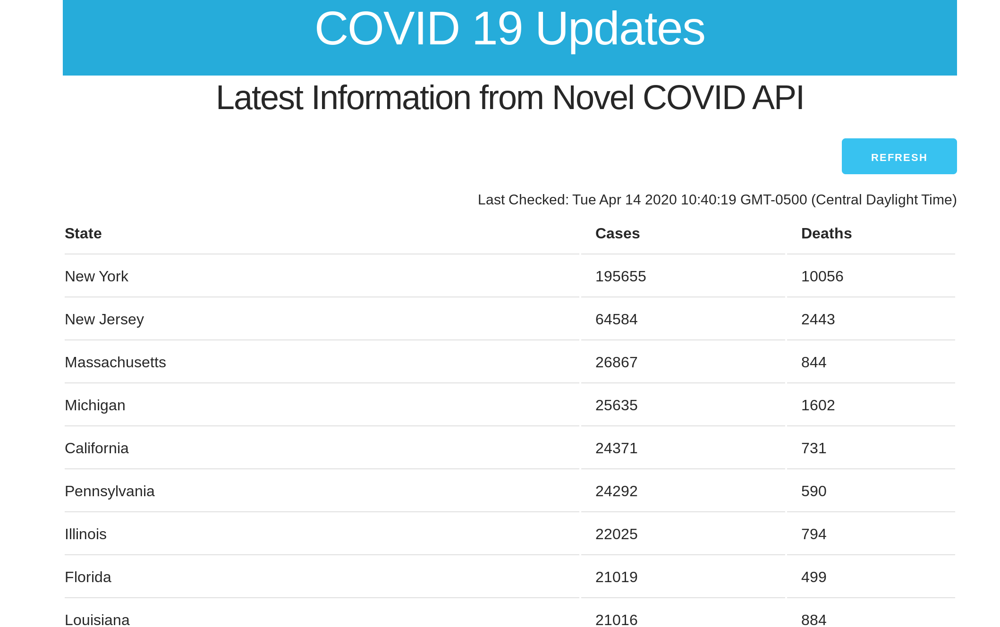

# Homework 9 - COVID App

## Due April 23 (If you need more time, just let me know)

For this final assignment, I would like you to build a simple app that makes a 
request to an API and displays the result. The API we will use is the 
[NOVELCOVID 
API](https://documenter.getpostman.com/view/8854915/SzS7R6uu?version=latest) 
which has all the latest information about the spread of the COVID virus. Take 
a look at the page and follow some of the URLs in your browser. Get a feel for 
the information that is available.

On our server, create two files in your public_html directory: covid.html and 
covid.js. Make sure to also add jQuery and Skeleton CSS to your HTML page.  
Create a page that looks something like this:



The page should make an AJAX request to one of the API URLs. For this I'm using 
[https://corona.lmao.ninja/states](https://corona.lmao.ninja/states) to show 
data by states, by you are free to use another one. The page should then 
display that information in an HTML table. There should further be a button so 
that the user can refresh the data.

For full credit your page must:

1. Include all css and javascript files correctly
2. Contain a correctly formatted HTML table
3. Make a successful request to the NOVELCOVID API
4. Correctly display the data in your page

Feel free to add any features or data you might want for two points extra 
credit.

HINT: To include the date and time of the data, as in the example, make use of 
javascript's built-in Date object:

```js

var now = new Date()
console.log(now.toString());

```

Try that code in your console to see how it works. In the app, you would be 
using jQuery to insert the data in your page, rather than console.log.

Good luck!

