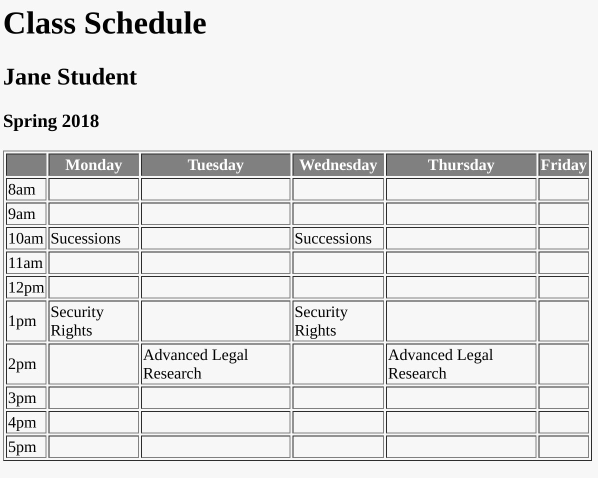

# Homework #3 - Tables

## Due Wednesday, February 3 at 5pm.

For this assignment, I would like you to create a table which contains your 
class schedule for this semester. The table will look something like this, but 
will contain your actual class schedule along with the correct times:

For full credit, your markup must be correct, with no missing tags. Your table 
needs to have a thead and tbody section. Extra credit will be given if you put 
a grey background with white text in your header, as shown in the example.

For this assignment, your file should be named homework3.html and you should 
place it in your public_html directory.
