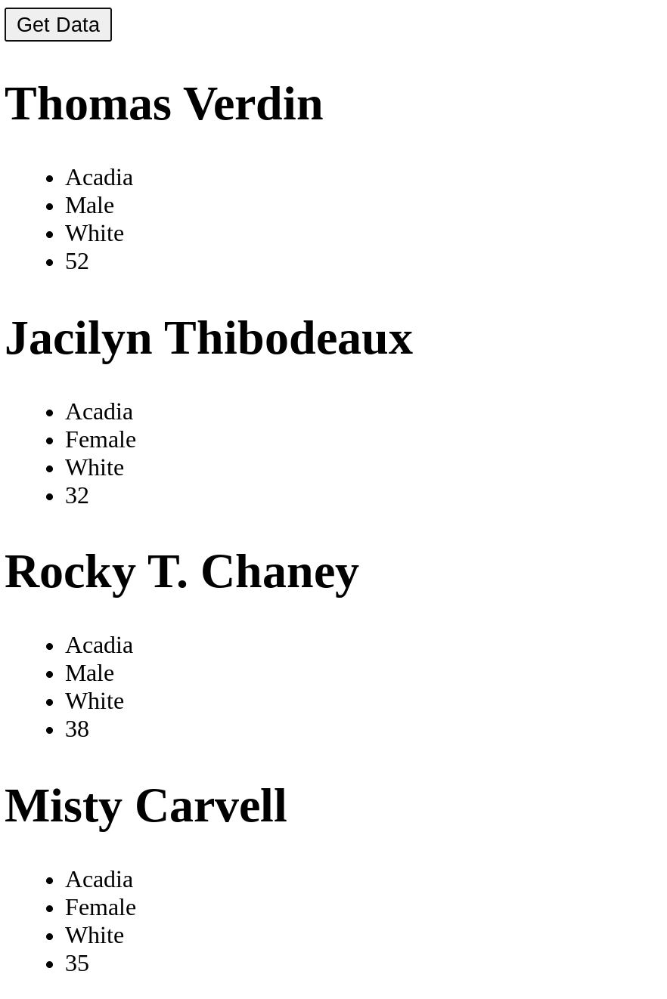

# Homework 8 - Working with JSON and APIs
## Due Wednesday, March 24 at 5pm

Following on what we did in class today, I would like you to practice making a 
request for some JSON via AJAX and putting the results in an HTML document.  Please
take a look at the data produced by the Incarceration Transparency API:

https://www.incarcerationtransparency.org/api/v1/records/deaths_db/   

For this assignment, please create a page called jsonhm.html and put it in your 
public_html directory.  Also create an associated javascript file jsonhm.js.
Your HTML file will contain a button and a div for some text.  When the user 
clicks the button, an AJAX request is made to that URL and information about 
each death is displayed in your div. The data that you should display can be 
found in the following keys: decedent_name, facility, Parish, sex, race, age.
The decedent's name should be presented in an H1 tag. All other data should be 
in an unordered list (UL).

### Tip:

Look carefully at how the JSON response is formatted. The data object has an 
array called "records" in which all of the records are contained. That array is 
what you want to loop through. So, when starting your loop, you would refer to

```js
data.records.forEach(....
```

NOT
```js
data.forEach(....
```
like we did in class today. Here's is what your output should look like:




