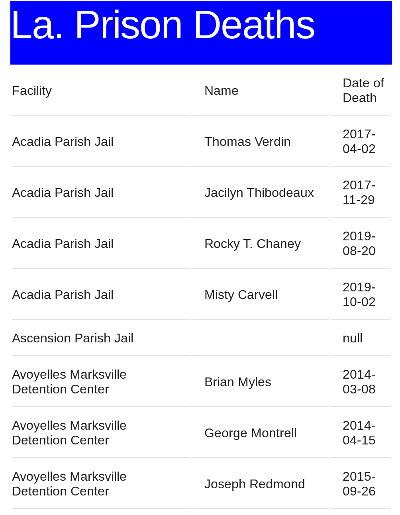

# Final Project (40 points)

# Due Thursday May 19 by 5pm

The final project aims to synthesize everything you have learned in the clinic 
this semester. You will create a small app that displays data from Prof.  
Armstrong's
[Incarceration 
Transparency](https://www.incarcerationtransparency.org/?page_id=1440) website 
API.

To start your project, follow these steps:

1. Create three files in your public_html folder: project.html, project.css, 
   project.js.  Be sure to load jQuery and Skeleton CSS in your project.html
   page.

2. Using the Skeleton grid system to create a page with a header which says 
   what the name of your app is and then a body where the data will be 
   displayed.

3. In your javascript file, make an AJAX request to https://incarcerationtransparency.org/api/v1/records/deaths_db/
   and display the results in a table when the document is loaded. Your table 
   should include at least the following columns: Facility, Decedent Name, and 
   Date of Death. Ensure that your page displays properly both on desktop and 
   mobile.

Here is an example of what all of this might look like:

If you complete all of the steps above successfully with no errors, you will 
receive the full 40 points for this project. If you would like to receive extra 
credit (up to 20 points), add some additional features. Here are some 
suggestions:

* Design your page so that a user can click on a particular record and see a 
single page listing of all of the data associated with that record. 

* Create a search box which allows the user to search for a decedent by name.
The URL for such a search request would be:

https://incarcerationtransparency.org/api/v1/records/deaths_db/?filter=decedent_name,cs,[SEARCH_TERM]

So, if you were looking for all decedents whose name includes "Smith" the query 
would be: 

https://incarcerationtransparency.org/api/v1/records/deaths_db/?filter=decedent_name,cs,Smith

Good luck!

**You may not collaborate with any one else on this project. All work must be 
your own. You can consult your past Tech Clinic work, our class videos, and any 
internet reference sites.**
