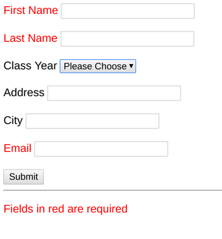

# Homework 3 - Forms 

## Due Wednesday, February 9 by 5pm

For this homework, you will create a form that looks like this:

Your form should submit a POST request to 
https://loyolalawtech.org/homework/form.php with no errors (NB: this is not 
dev.loyolalawtech.org, but just loyolalawtech.org).  The server should respond 
with the data you submit.  The server expects your inputs to have the following 
"name" properties: fname, lname, address, year, city, email.

To have your form labels display in red for "required", you will have to supply
some CSS. Feel free to consult the web on the best way to do this.

Your form should be in a file called homework3.html in your public_html folder.

### Possible Extra Credit

* Do some research on input "types". Use the type "email" to check whether
the user has given a valid address before the form is submitted.

* Do some research on the "required" input property. Make sure your user cannot
submit the form without filling in required fields.
