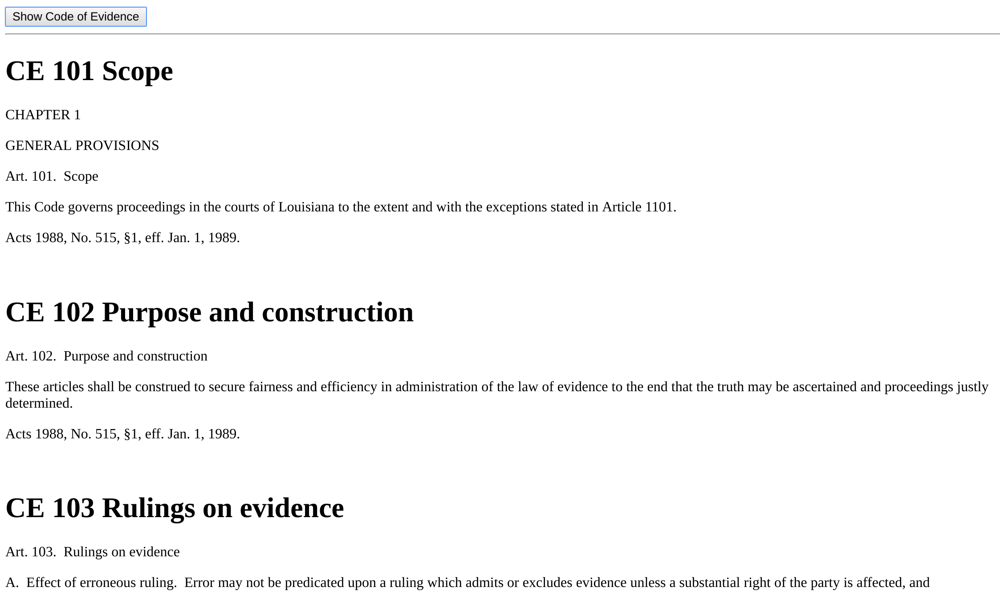

# Homework 8 - Working with JSON
## Due Wednesday, April 6 at 5pm

Following on what we did in class today, I would like you to practice making a 
request for some JSON via AJAX and putting the results in an HTML document.  
Please take a look at https://loyolalawtech.org/json/evidence.json. This is the 
Louisiana Code of Evidence in JSON form.  

For this assignment, please create a page which contains a button and a div for 
some text. When the user clicks the button, an AJAX request is made to that URL 
and the Code of Evidence articles are displayed inside the div. The keys from 
each object that you will have to use are "title", "description", and 
"law_text".  Your output should look something like this:

HINT: Look at your code from today's class. All that you need to do this 
assignment is there, with a few minor changes.

